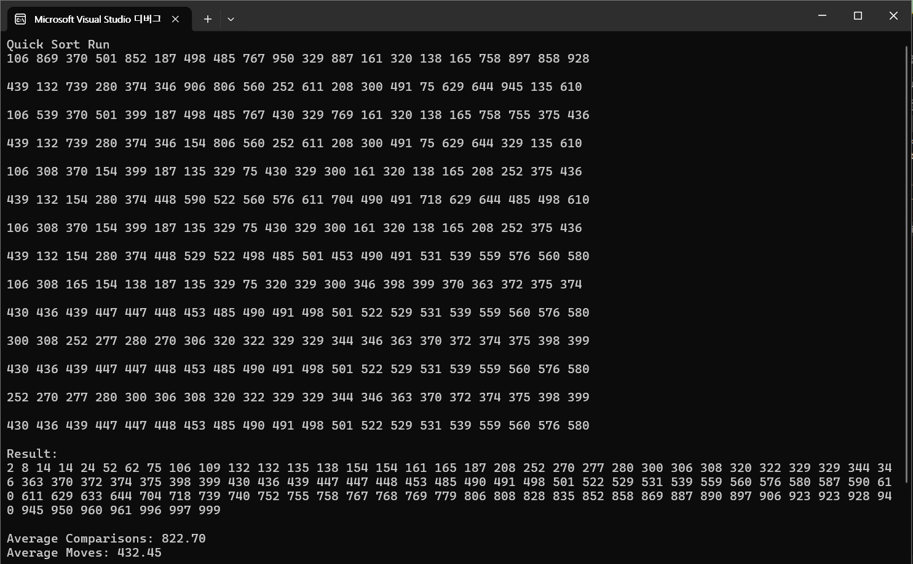

# Quick Sort {Result Image}

이 과제에서는 퀵 정렬(Quick Sort)을 비재귀적 방식으로 구현하고, 선택 정렬, 삽입 정렬, 버블 정렬, 쉘 정렬, 합병 정렬과 성능을 비교합니다. 각 정렬 알고리즘은 100개의 랜덤한 데이터에 대해 20회 반복 실행하며, 비교 횟수와 데이터 이동 횟수를 측정합니다.

Quick Sort (비재귀)
분할 정복 알고리즘으로, 데이터를 피벗 기준으로 나누고, 재귀 대신 스택을 이용하여 정렬.
일반적으로 평균 시간 복잡도는 O(n log n)이며, 최악의 경우 O(n²)입니다.

Selection Sort (선택 정렬)
매 단계에서 최소값(또는 최대값)을 찾아 현재 위치에 교환.
O(n²) 시간 복잡도를 가지며, 비교 횟수가 많음.

Insertion Sort (삽입 정렬)
배열의 요소를 순차적으로 탐색하며, 적절한 위치에 삽입.
O(n²) 시간 복잡도지만, 이미 정렬된 배열에 가까울수록 성능이 좋아짐.

Bubble Sort (버블 정렬)
인접한 두 요소를 비교하여 교환, 가장 큰 요소가 반복적으로 정렬됨.
O(n²) 시간 복잡도로, 효율이 가장 낮음.

Shell Sort (셸 정렬)
삽입 정렬의 개선 버전으로, 간격을 조정하며 정렬을 수행.
평균 시간 복잡도는 O(n log² n).

Merge Sort (합병 정렬)
데이터를 절반으로 나누어 재귀적으로 정렬 후 병합.
O(n log n) 시간 복잡도를 가지며, 안정적인 정렬 방식.

퀵 정렬은 대부분의 경우에서 다른 정렬 방법에 비해 비교적 빠르고 효율적인 성능을 보입니다.
